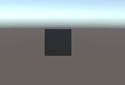

# INTERACTIVOS_2_REPARTIDOR

## Prototipo #1

Brainstorm
Comenzamos pensando diversas formas de llegar a entregar algo entretenido, educativo y que a su vez cumpliese las expectativas del curso, para cumplir todos estos objetivos se nos ocurrió crear un juego donde tengas que moverte a través de una ciudad en un coche respetando las reglas de tránsito, de esta manera conectamos de diferentes maneras diversos dispositivos a un computador, como por ejemplo un celular para tomar la inclinación del volante, una cámara live motion para hacer los cambios de marcha y un controlador para acelerar y frenar con los pies.

:quality(85)//cloudfront-us-east-1.images.arcpublishing.com/infobae/M4TLYYA5CZDUFGQFUEHOLVYWSI.jpg)

Estuve trabajando principalmente con el fin de encontrar una manera de conectar las acciones de un cubo en Unity que respondiese a las señales que se les enviase, para esto probé este codigo proporcionado por el profesor: 
using System.Collections;
using System.Collections.Generic;
using System.Net;
using System.Net.Sockets;
using System.Text;
using System.Threading;
using UnityEngine;

public class comm : MonoBehaviour
{

    private static comm instance;
    private Thread receiveThread;
    private UdpClient receiveClient;
    private IPEndPoint receiveEndPoint;
    public string ip = "0";
    public int receivePort = 32002;
    private bool isInitialized;
    private Queue receiveQueue;
    public GameObject cube;
    private Material m_Material;

    private void Awake()
    {
        Initialize();
    }

    private void Start()
    {
        m_Material = cube.GetComponent<Renderer>().material;
    }

    private void Initialize()
    {
        instance = this;
        receiveEndPoint = new IPEndPoint(IPAddress.Parse(ip), receivePort); //recibe la informacion
        receiveClient = new UdpClient(receivePort);
        receiveQueue = Queue.Synchronized(new Queue()); //puerta
        receiveThread = new Thread(new ThreadStart(ReceiveDataListener)); //Crear nuevo hilo
        receiveThread.IsBackground = true;
        receiveThread.Start();
        isInitialized = true;
    }

    private void ReceiveDataListener()
    {
        while (true)
        {
            try
            {
                byte[] data = receiveClient.Receive(ref receiveEndPoint);
                string text = Encoding.UTF8.GetString(data);
                SerializeMessage(text);
            }
            catch (System.Exception ex)
            {
                Debug.Log(ex.ToString());
            }
        }
    }

    private void SerializeMessage(string message)
    {
        try
        {
            string[] chain = message.Split(' ');
            string key = chain[0];
            float value = 0;
            if (float.TryParse(chain[1], out value))
            {
                receiveQueue.Enqueue(value);
            }
        }
        catch (System.Exception e)
        {
            Debug.Log(e.ToString());
        }
    }

    private void OnDestroy()
    {
        TryKillThread();
    }

    private void OnApplicationQuit()
    {
        TryKillThread();
    }

    private void TryKillThread()
    {
        if (isInitialized)
        {
            receiveThread.Abort();
            receiveThread = null;
            receiveClient.Close();
            receiveClient = null;
            Debug.Log("Thread killed");
            isInitialized = false;
        }
    }

    void Update()
    {
        if (receiveQueue.Count != 0)
        {
            float counter = (float)receiveQueue.Dequeue();

            if (counter == 1F) m_Material.color = Color.black;
            if (counter == 2F) m_Material.color = Color.red;
        }

    }

}
## Prototipo #2
con este logré hacer que el cubo cambiase de color al enviarle un mensaje a través de Hercules Terminal, sigo investigando la manera de enviar estos mensajes a través del celular.

Para lograr que el cubo recibiera algo más allá de únicamente ordenes de ponerse en rojo o negro, usamos una aplicación llamda zig zim, con ella le enviamos la información de un array llamado “gravity” para esto modificamos el codigo, y con esto le pedimos que al recibir valores dentro de ciertos márgenes el cubo se voltease.

[(Giro del cubo)](https://www.youtube.com/watch?v=OpWp2a5FJ08)

Ahora que se mueve hicimos un playerController, el cual tiene como función mover el cubo hacia adelante y agregarle un collider, el cual le proporcionó la gravedad a el cubo y la posibilidad de colisionar con diferentes objetos del escenario.

[(Movimiento del cubo)](https://youtu.be/MATfODdEWHo)

Se hizo un modelo del carro lowpoly, que no consuma muchos recursos ya que probando assets de vehiculos realistas consumia demasiado, tuvimos unos problemas breves exportando los modelos a unity pero se logor solucionar para que quedara como deberia.

Ya con esto funcionando tomamos, el cubo y lo reemplazamos por un asset de un vehículo, y un escenario de una pequeña ciudad el cual le agregó mucho movimiento, a demás de hacer posible que el vehículo se pueda encender, apagar, tener 5 cambios diferentes a demás de acelerar y desacelerar dependiendo de como utilices el botón destinado para ello

[(Carro en movimiento)](https://youtu.be/uHbwmQEYOUw)

Las mecanicas ya estan planteadas para implementarse, tanto las del usuario como las de los obstaculos y mundo; y el mapeado tambien esta planteado, falta la construccion y definir assets que se van a usar

## leap

implemente el funcionamiento del leap pero aun no puedo hacer prubas en implamentes una zona de pruebas donde las personas puedadn trabajar al igual que las ramificaciones. un ma dificialta es el que no pude encontrar una palaca de cambios y por eso decidi modelarda.

Al momento de adaptar las manos con la interacción hubo un error que rompía el rig de las manos, no permitiendo interacciones 

pero se logró corregir remplazando por otro modelo de malos.
en cuanto a la palanca se mantiene funcionando pero requiere de un rig propio para que no se dañe la caja de cambios

## Avance 3.1

Encontramos un error el cual no permitía comunicar el Leap y el teclado al tiempo, esta incompatibilidad se debía a que estábamos utilizando “(Input.GetKeyDown(KeyCode.W))” tanto en los botones del Leap como en los del teclado lo que generaba incompatibilidades dado a que al presionar el boton no se daba la acción esperada, introducimos dos cajas que hagan la función de botones, y así poder controlar los cambios del vehículo a partir del Leap.

Se tomaron las medidas y planteamos lo materiales que se usaran para el montaje, en el que al inicio planeabamos hacerlo con tubos PVC por su alta resistencia pero seria muy costoso, por lo que al final se decidio que usariamos madera ya que tenemos las herramientas para trabajar con madera y es mas flexible, el unico problema que tendremos con un montaje en madera es el transporte, ya que no se puede desensamblar las piezas para transportarlo, al contrario de PVC. Se plantea que se movera la silla para acomodar a los diferentes usuarios con un mecanismo parecido al de los vehiculos. Se le realizaron unos planos y un modelo 3D al montaje para tener la idea, esta planeado comprar los materiales y empezar a hacerlo para la proxima semana.

El mapa esta en proceso, cerca de terminarse para empezar a implementar los anteriores avances para estar montando todo.

## Avance 3.2

El montaje esta planeado y tenemos los materiales en el taller listo para empezar a trabajarlo, es en madera ya que es lo mas economico y estable que podemos lograr.

El mapa ya tiene todas las vias que es el lugar donde estara el usuario disfrutando de la experiencia, falta sus edificios y decoraciones para que quede listo, y las mecanicas que usaremos para el mapa ya estan planteadas pero tenemos que implementarlas y probar; Y arreglamos el boton que se usara para los cambios del carro, que quede mejor para el leap.

logramos haer que el auto acelerase y frenase con un arduino, el cual planeamos remplazar con pedales que simulen los de un auto.
[(Carro con arduino)](https://youtu.be/3Pfn4QPQpIo)
logramos integrar el nuevo mapa  y el carrito en una sola escena.

## Prototipo #3

se logró incluir pickUps al juego los cuales actualizan un contador de puntaje, con el que se espera poner mecanicas de juego en el juego.
[(Puntos)](https://youtu.be/LEv6bhEyH9s)

los auidos fuero buscados en freesouds y seran editados en reperper.

## Avance 4.1

En este se logró agregar un cronometro el cual se planea utilizar despues en conjunto con los pickups para generar mecánicas de juego más interesantes, como que si no logra llevar las cosas a tiempo pierda.

se editaron los audios es se subieron a unity pero no sé a implementado en el carro porque probando hay ciertos errores, estos se editaron en reaper donde se implementaron filtros para mejor escucha

se diseñaron bocetos de los pedales pensando en las protoboars que se utilizaran, se habalon el equipo en clase, este boceto se hizo en photoshop 

## Avance 4.2

se logró incluir Personas y objetos que siguen una trayectoria.

[(PersonaCubo)](https://www.youtube.com/watch?v=ZD7wnSXbniI)

luego incluimos todo en un nuevo escenario con edificios y calles, y se agrego un primero vehiculo.
[(Ciudad con auto)](https://youtu.be/b2xhdzx2LuI)

se hizo los modos para cortes de carro pero se sufre con muchos problemas de presupuesto y seria mas combebiente comprar inputs qye hacerlos por eso se desedira cpn el equipo 

los audios principales de carro fueron implementados pero faltan pruebas con el arduino y se desconose si funcionaran con esto dejo el codigo escrito

using System.Collections;
using System.Collections.Generic;
using System.Xml.Serialization;
using UnityEngine;
using UnityEngine.UI;
using UnityEngine.UIElements;
using System.IO.Ports;
using System;
using System.Runtime.Remoting.Services;

public class PlayerController2 : MonoBehaviour
{
    public byte run;
    public float cambio = 0f;
    public float speed = 0f;
    private Rigidbody rb;
    private bool acelerador = false;
    private bool freno = false;
    private SerialPort _serialPort;

    [Header("Audios")]
    [SerializeField] AudioSource audio_Arranque;
    [SerializeField] AudioSource audio_neutro;
    [SerializeField] AudioSource audio_movimiento;
    [SerializeField] AudioSource audio_freno;
    private void Start()
    {
        rb = GetComponent<Rigidbody>();
        openSerialPort();

    }
    private void openSerialPort()
    {
        try
        {
            _serialPort = new SerialPort();
            _serialPort.PortName = "COM3";
            _serialPort.BaudRate = 115200;
            _serialPort.DtrEnable = true;
            _serialPort.NewLine = "\n";
            _serialPort.Open();
            Debug.Log("Open Serial Port");

        }
        catch (Exception e)
        {
            Debug.Log(e);

        }

    }

    void Update()
    {

        transform.Translate(Vector3.down * Time.deltaTime * speed);
        if (_serialPort.BytesToRead > 0)
        {
            string response = _serialPort.ReadLine();
            if (response == "frenoPressed")
            {
                freno = true;
                Debug.Log("frenoPressed");
            }
            if (response == "frenoReleased")
            {
                freno = false;
                Debug.Log("frenoReleased");
            }
            if (response == "accPressed")
            {
                acelerador = true;

            }
            if (response == "accReleased")
            {
                acelerador = false;

            }

        }

        if (Input.GetKeyDown(KeyCode.C)) 
        {
            run = 1;
            encendido();
        }
        if (Input.GetKeyDown(KeyCode.V)) 
        {
            run = 0; 
        }
        if ((speed < cambio)) 
        { 
            MasSpeed(); 
        } 
        else 
        {
            MenosSpeed(); 
        }
        if (run == 0) MenosSpeed();
        if (speed <= 0) speed = 0;
        if (cambio <= 0) cambio = 0;
        if (cambio >= 12) cambio = 12;
        if (speed - cambio <= -6) { MenosSpeed(); }

    }
    void MasSpeed()
    {
        if (run == 1)
        { 
            if (true == acelerador) 
            { 
                speed += 0.02f;
                audio_neutro.Stop();
                audio_movimiento.Play();
            }
            else 
            {
                MenosSpeed();
                audio_movimiento.Stop();
                audio_freno.Play();
                audio_neutro.PlayDelayed(1f);
            }
        }
       
    }
    void MenosSpeed()
    {
        speed -= 0.02f;
    }
    public void sube()
    {
        cambio += 2f;
    }
    public void baja()
    {
        cambio -= 2f;
    }
    public void encendido()
    {
        audio_Arranque.Play();
        audio_neutro.PlayDelayed(2f);
    }
 
}

## Avance 4.3

Los pedales se imprimieron y se armaron con respeto a los materiales siendo un prototipo con materiales con respecto al presupuesto. 

Una dificulta y a que a un es, es la resistencia de este con respecto al peso.

en tema de audios se cambiaron gracias a los de una página
http://www.sonidosmp3gratis.com/auto

Se agregaron más vehículos a la escena con sus respectivas rutas para darle más vida al mapa.

